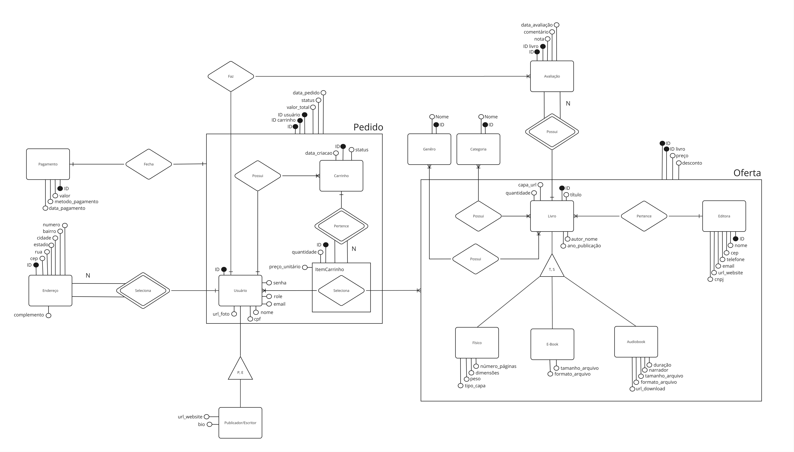

# Modelagem de Banco de Dados

- Esse repositóprio se resume exclusivamente a Modelagem de Banco de Dados do projeto LibSpace, no qual esse e mais 1 Repositório fazem parte do mesmo projeto.
- Repositório [Back-End](https://github.com/pereiraR3/BackEnd-LibSpace-Online-bookstore-system)
## Modelagem Conceitual

### DER (Diagrama Entidade-Relacionamento)


### Dicionário de Dados

O dicionário é um recurso que contém palavras organizadas em ordem alfabética, cada uma acompanhada de informações sobre o significado, pronúncia, uso e, em alguns casos, origem. A principal utilidade de um dicionário é fornecer definições claras e compreensíveis das palavras, ajudando as pessoas a entenderem o significado e o contexto de termos específicos em uma língua. Dado isso, foi elaborado o seguinte dicionário de dados, de modo a facilitar a leitura do DER.

#### Dicionário Entidade & Relacionamento

Logo abaixo, tem-se todas as informações sobre as Entidades e seus respectivos relacionamentos. Essas informações estão disponíveis para facilitar o entendimento da Modelagem de Dados.

- **Users**: Representa os usuários do sistema. Cada usuário possui um CPF, nome, senha, e-mail, foto, site, biografia e um papel (role).
- **Endereço**: Contém informações de endereço dos usuários, incluindo CEP, rua, número, bairro, estado e cidade.
- **Livro**: Detalha informações dos livros, como título, quantidade, nome do autor, ano de publicação e URL da capa.
- **Livro Físico**: Especifica características físicas dos livros, como número de páginas, peso, tipo de capa e dimensões.
- **Livro Ebook**: Armazena informações sobre os e-books, incluindo tamanho do arquivo e formato.
- **Livro Audiobook**: Contém detalhes sobre os audiobooks, como tamanho do arquivo, formato, narrador e URL para download.
- **Avaliação**: Armazena avaliações dos livros feitas pelos usuários, incluindo nota, comentário e data da avaliação.
- **Categoria**: Descreve as diferentes categorias dos livros.
- **Editora**: Contém informações sobre as editoras dos livros, incluindo nome, CNPJ, CEP, telefone, e-mail e site.
- **Oferta**: Detalha as ofertas de livros, incluindo preço e desconto.
- **Carrinho**: Representa o carrinho de compras dos usuários, incluindo status do carrinho.
- **Item Carrinho**: Detalha os itens contidos no carrinho de compras.
- **Pedido**: Contém informações sobre os pedidos feitos pelos usuários, incluindo valor total e status.
- **Pagamento**: Registra os pagamentos feitos, incluindo valor, método de pagamento e data do pagamento.

#### Dicionário Tabela & Atributo

A seguir estão todas as informações sobre as Entidades e seus respectivos atributos. Essas informações estão disponíveis para facilitar o entendimento da Modelagem de Dados.

- **Users**
  - `id` (BIGSERIAL, PRIMARY KEY): Identificador único do usuário.
  - `cpf` (BIGINT, UNIQUE, NOT NULL): CPF do usuário.
  - `nome` (VARCHAR(60), NOT NULL): Nome do usuário.
  - `senha` (TEXT, NOT NULL): Senha do usuário.
  - `email` (VARCHAR(120), UNIQUE, NOT NULL): E-mail do usuário.
  - `url_foto` (TEXT): URL ou Caminho de Diretório da foto do usuário.
  - `url_website` (TEXT): URL do site do usuário.
  - `bio` (VARCHAR(2000), NOT NULL): Biografia do usuário.
  - `role` (VARCHAR(20), NOT NULL): Papel do usuário no sistema.

- **Endereço**
  - `id` (BIGSERIAL, PRIMARY KEY): Identificador único do endereço.
  - `id_user` (BIGINT, NOT NULL, FOREIGN KEY): Identificador do usuário relacionado.
  - `cep` (BIGINT, NOT NULL): CEP do endereço.
  - `rua` (VARCHAR(120), NOT NULL): Nome da rua.
  - `numero` (SMALLINT, NOT NULL): Número do endereço.
  - `bairro` (VARCHAR(100), NOT NULL): Nome do bairro.
  - `estado` (VARCHAR(60), NOT NULL): Nome do estado.
  - `cidade` (VARCHAR(60), NOT NULL): Nome da cidade.

- **Editora**
  - `id` (BIGSERIAL, PRIMARY KEY): Identificador único da editora.
  - `nome` (VARCHAR(120), NOT NULL): Nome da editora.
  - `cnpj` (BIGINT, UNIQUE, NOT NULL): CNPJ da editora.
  - `cep` (BIGINT, NOT NULL): CEP da editora.
  - `telefone` (CHAR(11), NOT NULL): Telefone da editora.
  - `email` (VARCHAR(120), UNIQUE, NOT NULL): E-mail da editora.
  - `url_website` (TEXT): URL do site da editora.

- **Livro**
  - `id` (BIGSERIAL, PRIMARY KEY): Identificador único do livro.
  - `id_editora` (BIGINT, FOREIGN KEY): Identificador da editora.
  - `preco` (MONEY, NOT NULL): Preço do livro.
  - `titulo` (VARCHAR(120), NOT NULL): Título do livro.
  - `quantidade` (SMALLINT, NOT NULL): Quantidade disponível.
  - `autor_nome` (VARCHAR(160), NOT NULL): Nome do autor.
  - `ano_publicacao` (SMALLINT, NOT NULL): Ano de publicação.
  - `capa_url` (TEXT, NOT NULL): URL da capa do livro.

- **Livro Físico**
  - `id_livro` (BIGSERIAL, PRIMARY KEY): Identificador único do livro físico e FK em relação a livro.
  - `numero_de_paginas` (SMALLINT, NOT NULL): Número de páginas.
  - `peso` (SMALLINT, NOT NULL): Peso do livro.
  - `tipo_capa` (VARCHAR(60), NOT NULL): Tipo de capa.
  - `dimensao_altura` (SMALLINT, NOT NULL): Altura do livro.
  - `dimensao_largura` (SMALLINT, NOT NULL): Largura do livro.
  - `dimensao_profundidade` (SMALLINT, NOT NULL): Profundidade do livro.

- **Livro Ebook**
  - `id_livro` (BIGSERIAL, PRIMARY KEY): Identificador único do e-book e FK em relação a livro. 
  - `tamanho_arquivo` (SMALLINT, NOT NULL): Tamanho do arquivo.
  - `formato_arquivo` (VARCHAR(40), NOT NULL): Formato do arquivo.

- **Livro Audiobook**
  - `id_livro` (BIGSERIAL, PRIMARY KEY): Identificador único do audiobook e FK em relação a livro.
  - `tamanho_arquivo` (SMALLINT, NOT NULL): Tamanho do arquivo.
  - `formato_arquivo` (VARCHAR(40), NOT NULL): Formato do arquivo.
  - `narrador` (VARCHAR(120), NOT NULL): Nome do narrador.
  - `url_download` (TEXT, NOT NULL): URL para download.

- **Avaliação**
  - `id` (BIGSERIAL, PRIMARY KEY): Identificador único da avaliação.
  - `id_user` (BIGINT, NOT NULL, FOREIGN KEY): Identificador do usuário relacionado.
  - `id_livro` (BIGINT, NOT NULL, FOREIGN KEY): Identificador do livro relacionado.
  - `nota` (SMALLINT, NOT NULL, CHECK(nota IN (0, 1, 2, 3, 4, 5))): Nota da avaliação.
  - `comentario` (VARCHAR(1000), NOT NULL): Comentário da avaliação.
  - `data_avaliacao` (DATE, DEFAULT CURRENT_DATE): Data da avaliação.

- **Categoria**
  - `id` (BIGSERIAL, PRIMARY KEY): Identificador único da categoria.
  - `nome` (VARCHAR(60), NOT NULL): Nome da categoria.

- **Genêro**
  - `id` (BIGSERIAL, PRIMARY KEY): Identificador único de genêro.
  - `nome` (VARCHAR(60), NOT NULL): Nome do genêro.

- **Livro Possui Categoria**
  - `id_livro` (BIGINT, NOT NULL, FOREIGN KEY): Identificador do livro.
  - `id_categoria` (BIGINT, NOT NULL, FOREIGN KEY): Identificador da categoria.
  - `UNIQUE (id_livro, id_categoria)`: Constrição de unicidade para garantir que a combinação livro-categoria seja única.

- **Livro Possui Categoria**
  - `id_livro` (BIGINT, NOT NULL, FOREIGN KEY): Identificador do livro.
  - `id_genero` (BIGINT, NOT NULL, FOREIGN KEY): Identificador do genêro.
  - `UNIQUE (id_livro, id_genero)`: Constrição de unicidade para garantir que a combinação livro-genêro seja única.

- **Oferta**
  - `id` (BIGSERIAL, PRIMARY KEY): Identificador único da oferta.
  - `id_livro` (BIGINT, NOT NULL, FOREIGN KEY): Identificador do livro.
  - `id_editora` (BIGINT, FOREIGN KEY): Identificador da editora.
  - `preco` (MONEY, NOT NULL): Preço da oferta.
  - `desconto` (DECIMAL(5, 2)): Desconto aplicado à oferta.

- **Carrinho**
  - `id` (BIGSERIAL, PRIMARY KEY): Identificador único do carrinho.
  - `id_user` (BIGINT, NOT NULL, FOREIGN KEY): Identificador do usuário.
  - `data_criacao` (DATE, DEFAULT CURRENT_DATE): Data de criação do carrinho.
  - `status` (BOOLEAN, DEFAULT TRUE): Status do carrinho (False = Carrinho fechado).

- **Item Carrinho**
  - `id` (BIGSERIAL, PRIMARY KEY): Identificador único do item no carrinho.
  - `id_user` (BIGINT, NOT NULL, FOREIGN KEY): Identificador do usuário.
  - `id_oferta` (BIGINT, NOT NULL, FOREIGN KEY): Identificador da oferta.
  - `id_carrinho` (BIGINT, NOT NULL, FOREIGN KEY): Identificador do carrinho.
  - `quantidade` (SMALLINT, NOT NULL): Quantidade do item.
  - `preco_unitario` (MONEY, NOT NULL): Preço unitário do item.
  - `UNIQUE (id_user, id_oferta, id_carrinho)`: Constrição de unicidade para garantir que a combinação usuário-oferta-carrinho seja única.

- **Pedido**
  - `id` (BIGSERIAL, PRIMARY KEY): Identificador único do pedido.
  - `id_user` (BIGINT, NOT NULL, FOREIGN KEY): Identificador do usuário.
  - `id_carrinho` (BIGINT, NOT NULL, FOREIGN KEY): Identificador do carrinho.
  - `valor_total` (MONEY, NOT NULL): Valor total do pedido.
  - `status` (BOOLEAN, DEFAULT FALSE): Status do pedido (False = Sem pagamento).
  - `data_pedido` (DATE, DEFAULT CURRENT_DATE): Data do pedido.

- **Pagamento**
  - `id` (BIGSERIAL, PRIMARY KEY): Identificador único do pagamento.
  - `id_pedido` (BIGINT, NOT NULL, FOREIGN KEY): Identificador do pedido.
  - `valor` (MONEY, NOT NULL): Valor do pagamento.
  - `metodo_pagamento` (VARCHAR(100), NOT NULL): Método de pagamento.
  - `data_pagamento` (DATE, DEFAULT CURRENT_DATE): Data do pagamento.

## Modelagem Lógica


## Modelagem Física 

### SQL

```sql
-- Create table users
CREATE TABLE users (
    id BIGSERIAL PRIMARY KEY,
    cpf CHAR(11) UNIQUE NOT NULL,
    nome VARCHAR(60) NOT NULL, 
    senha TEXT NOT NULL, 
    email VARCHAR(120) UNIQUE NOT NULL,
    url_foto TEXT,
    url_website TEXT, 
    bio VARCHAR(2000) NOT NULL,
    role VARCHAR(20) NOT NULL
);

-- Create table endereco
CREATE TABLE endereco (
    id BIGSERIAL PRIMARY KEY, 
    id_user BIGINT NOT NULL,
    cep BIGINT NOT NULL,
    rua VARCHAR(120) NOT NULL,
    numero SMALLINT NOT NULL,
    bairro VARCHAR(100) NOT NULL,
    estado VARCHAR(60) NOT NULL,
    cidade VARCHAR(60) NOT NULL,
    CONSTRAINT fk_user_in_endereco FOREIGN KEY (id_user) REFERENCES users (id) ON DELETE CASCADE
);

-- Create table editora
CREATE TABLE editora (
    id BIGSERIAL PRIMARY KEY, 
    nome VARCHAR(120) NOT NULL,
    cnpj BIGINT UNIQUE NOT NULL,
    cep BIGINT NOT NULL, 
    telefone CHAR(11) NOT NULL, 
    email VARCHAR(120) UNIQUE NOT NULL,
    url_website TEXT
);

-- Create table livro
CREATE TABLE livro (
    id BIGSERIAL PRIMARY KEY, 
    id_editora BIGINT,
    preco MONEY NOT NULL,   
    titulo VARCHAR(120) NOT NULL, 
    quantidade SMALLINT NOT NULL,
    autor_nome VARCHAR(160) NOT NULL,
    ano_publicacao SMALLINT NOT NULL,
    capa_url TEXT NOT NULL,
    CONSTRAINT fk_editora_in_livro FOREIGN KEY (id_editora) REFERENCES editora (id) ON DELETE SET NULL
);

-- Create table livro_fisico
CREATE TABLE livro_fisico (
    id_livro BIGINT PRIMARY KEY, 
    numero_de_paginas SMALLINT NOT NULL,
    peso SMALLINT NOT NULL,
    tipo_capa VARCHAR(60) NOT NULL,
    dimensao_altura SMALLINT NOT NULL,
    dimensao_largura SMALLINT NOT NULL,
    dimensao_profundidade SMALLINT NOT NULL,
    CONSTRAINT fk_livro_in_livrofisico FOREIGN KEY (id_livro) REFERENCES livro (id) ON DELETE CASCADE
);

-- Create table livro_ebook
CREATE TABLE livro_ebook (
    id_livro BIGINT PRIMARY KEY, 
    tamanho_arquivo SMALLINT NOT NULL,
    formato_arquivo VARCHAR(40) NOT NULL,
    CONSTRAINT fk_livro_in_livroebook FOREIGN KEY (id_livro) REFERENCES livro (id) ON DELETE CASCADE
);

-- Create table livro_audiobook
CREATE TABLE livro_audiobook (
    id_livro BIGINT PRIMARY KEY, 
    tamanho_arquivo SMALLINT NOT NULL,
    formato_arquivo VARCHAR(40) NOT NULL,
    narrador VARCHAR(120) NOT NULL, 
    url_download TEXT NOT NULL,
    CONSTRAINT fk_livro_in_livroaudiobook FOREIGN KEY (id_livro) REFERENCES livro (id) ON DELETE CASCADE
);

-- Create table avaliacao
CREATE TABLE avaliacao (
    id BIGSERIAL PRIMARY KEY, 
    id_user BIGINT NOT NULL,
    id_livro BIGINT NOT NULL, 
    nota SMALLINT CHECK(nota IN (0, 1, 2, 3, 4, 5)) NOT NULL,
    comentario VARCHAR(1000) NOT NULL,
    data_avaliacao DATE DEFAULT CURRENT_DATE, 
    CONSTRAINT fk_user_in_avaliacao FOREIGN KEY (id_user) REFERENCES users (id) ON DELETE CASCADE,
    CONSTRAINT fk_livro_in_avaliacao FOREIGN KEY (id_livro) REFERENCES livro (id) ON DELETE CASCADE
);

-- Create table categoria
CREATE TABLE categoria (
    id BIGSERIAL PRIMARY KEY, 
    nome VARCHAR(60) NOT NULL
);

-- Create table genero
CREATE TABLE genero (
    id BIGSERIAL PRIMARY KEY,
    nome VARCHAR(60) NOT NULL
);

-- Create table livro_possui_categoria
CREATE TABLE livro_possui_categoria (
    id_livro BIGINT NOT NULL,
    id_categoria BIGINT NOT NULL,
    CONSTRAINT uq_idlivro_e_idcategoria UNIQUE (id_livro, id_categoria), 
    CONSTRAINT fk_livro_in_livro_possui_categoria FOREIGN KEY (id_livro) REFERENCES livro (id) ON DELETE CASCADE,
    CONSTRAINT fk_categoria_in_livro_possui_categoria FOREIGN KEY (id_categoria) REFERENCES categoria (id) ON DELETE CASCADE
);

-- Create table livro_possui_genero
CREATE TABLE livro_possui_genero (
    id_livro BIGINT NOT NULL,
    id_genero BIGINT NOT NULL,
    CONSTRAINT uq_idlivro_e_idgenero UNIQUE (id_livro, id_genero), 
    CONSTRAINT fk_livro_in_livro_possui_categoria FOREIGN KEY (id_livro) REFERENCES livro (id) ON DELETE CASCADE,
    CONSTRAINT fk_categoria_in_livro_possui_categoria FOREIGN KEY (id_genero) REFERENCES genero (id) ON DELETE CASCADE
);

-- Create table oferta
CREATE TABLE oferta (
    id BIGSERIAL PRIMARY KEY NOT NULL, 
    id_livro BIGINT NOT NULL,
    id_editora BIGINT DEFAULT NULL,
    preco MONEY NOT NULL,
    desconto DECIMAL(5, 2) DEFAULT 0,
    CONSTRAINT uq_livro_e_id UNIQUE (id, id_livro),
    CONSTRAINT fk_livro_in_oferta FOREIGN KEY (id_livro) REFERENCES livro (id) ON DELETE CASCADE,
    CONSTRAINT fk_editora_in_oferta FOREIGN KEY (id_editora) REFERENCES editora (id) ON DELETE SET NULL
);

-- Create table carrinho
CREATE TABLE carrinho (
    id BIGSERIAL PRIMARY KEY, 
    id_user BIGINT NOT NULL,
    data_criacao DATE DEFAULT CURRENT_DATE,
    status BOOLEAN DEFAULT TRUE NOT NULL,
    CONSTRAINT fk_user_in_carrinho FOREIGN KEY (id_user) REFERENCES users (id) ON DELETE CASCADE
);

-- Create table item_carrinho
CREATE TABLE item_carrinho (
    id BIGSERIAL PRIMARY KEY, 
    id_user BIGINT NOT NULL,
    id_oferta BIGINT NOT NULL,
    id_carrinho BIGINT NOT NULL,
    quantidade SMALLINT CHECK(quantidade > 0)NOT NULL,
    preco_unitario MONEY NOT NULL,
    CONSTRAINT uq_user_oferta_carrinho UNIQUE (id_user, id_oferta, id_carrinho),
    CONSTRAINT fk_user_in_item_carrinho FOREIGN KEY (id_user) REFERENCES users (id) ON DELETE CASCADE, 
    CONSTRAINT fk_oferta_in_item_carrinho FOREIGN KEY (id_oferta) REFERENCES oferta (id) ON DELETE CASCADE,
    CONSTRAINT fk_carrinho_in_item_carrinho FOREIGN KEY (id_carrinho) REFERENCES carrinho (id) ON DELETE CASCADE
);

-- Create table pedido
CREATE TABLE pedido (
    id BIGSERIAL PRIMARY KEY, 
    id_user BIGINT NOT NULL,
    id_carrinho BIGINT NOT NULL,
    valor_total MONEY NOT NULL,
    status BOOLEAN DEFAULT FALSE, 
    data_pedido DATE DEFAULT CURRENT_DATE, 
    CONSTRAINT fk_user_in_pedido FOREIGN KEY (id_user) REFERENCES users (id) ON DELETE CASCADE,
    CONSTRAINT fk_carrinho_in_pedido FOREIGN KEY (id_carrinho) REFERENCES carrinho (id) ON DELETE CASCADE
);

-- Create table pagamento
CREATE TABLE pagamento (
    id BIGSERIAL PRIMARY KEY, 
    id_pedido BIGINT NOT NULL,
    valor MONEY NOT NULL,
    metodo_pagamento VARCHAR(100) NOT NULL,
    data_pagamento DATE DEFAULT CURRENT_DATE, 
    CONSTRAINT fk_pedido_in_pagamento FOREIGN KEY (id_pedido) REFERENCES pedido (id) ON DELETE CASCADE
);

```
#

### SQL + COMMENT ON

<!-- Comentários em SQL -->
```sql


```


### Ocupação de Database (Peso)

- Aqui, neste tópico o objetivo é calcular o peso em bytes de cada tabela, de acordo com os tipos de dados usados, além de fazer estimativas e construir projeções de consumo de armazenamento. 

-  **Observação:** a informação sobre ocupação em bytes de cada tipo de dado foi obtida diretamente da documentação do **PostgreSQL em 2024**.

#### Tabelas

##### Users

| Campo      | Tipo           | Ocupação (bytes) |
|------------|----------------|------------------|
| id         | BIGSERIAL      | 8                |
| cpf        | BIGINT         | 8                |
| nome       | VARCHAR(60)    | 60               |
| senha      | TEXT           | 200 (estimado)   |
| email      | VARCHAR(120)   | 120              |
| url_foto   | TEXT           | 200 (estimado)   |
| url_website| TEXT           | 200 (estimado)   |
| bio        | VARCHAR(2000)  | 2000             |
| role       | VARCHAR(20)    | 20               |
| **Total**  |                | **2816**         |

##### Endereço

| Campo      | Tipo           | Ocupação (bytes) |
|------------|----------------|------------------|
| id         | BIGSERIAL      | 8                |
| id_user    | BIGINT         | 8                |
| cep        | BIGINT         | 8                |
| rua        | VARCHAR(120)   | 120              |
| numero     | SMALLINT       | 2                |
| bairro     | VARCHAR(100)   | 100              |
| estado     | VARCHAR(60)    | 60               |
| cidade     | VARCHAR(60)    | 60               |
| **Total**  |                | **366**          |

##### Livro

| Campo          | Tipo           | Ocupação (bytes) |
|----------------|----------------|------------------|
| id             | BIGSERIAL      | 8                |
| titulo         | VARCHAR(120)   | 120              |
| quantidade     | SMALLINT       | 2                |
| autor_nome     | VARCHAR(160)   | 160              |
| ano_publicacao | DATE           | 4                |
| capa_url       | TEXT           | 200 (estimado)   |
| **Total**      |                | **494**          |

##### Livro Físico

| Campo                | Tipo           | Ocupação (bytes) |
|----------------------|----------------|------------------|
| id_livro             | BIGSERIAL      | 8                |
| numero_de_paginas    | SMALLINT       | 2                |
| peso                 | SMALLINT       | 2                |
| tipo_capa            | VARCHAR(60)    | 60               |
| dimensao_altura      | SMALLINT       | 2                |
| dimensao_largura     | SMALLINT       | 2                |
| dimensao_profundidade| SMALLINT       | 2                |
| **Total**            |                | **78**           |

##### Livro Ebook

| Campo           | Tipo           | Ocupação (bytes) |
|-----------------|----------------|------------------|
| id_livro        | BIGSERIAL      | 8                |
| tamanho_arquivo | SMALLINT       | 2                |
| formato_arquivo | VARCHAR(40)    | 40               |
| **Total**       |                | **50**           |

##### Livro Audiobook

| Campo           | Tipo           | Ocupação (bytes) |
|-----------------|----------------|------------------|
| id_livro        | BIGSERIAL      | 8                |
| tamanho_arquivo | SMALLINT       | 2                |
| formato_arquivo | VARCHAR(40)    | 40               |
| narrador        | VARCHAR(120)   | 120              |
| url_download    | TEXT           | 200 (estimado)   |
| **Total**       |                | **370**          |

##### Avaliação

| Campo           | Tipo           | Ocupação (bytes) |
|-----------------|----------------|------------------|
| id              | BIGSERIAL      | 8                |
| id_user         | BIGINT         | 8                |
| id_livro        | BIGINT         | 8                |
| nota            | SMALLINT       | 2                |
| comentario      | VARCHAR(1000)  | 1000             |
| data_avaliacao  | DATE           | 4                |
| **Total**       |                | **1030**         |

##### Categoria

| Campo           | Tipo           | Ocupação (bytes) |
|-----------------|----------------|------------------|
| id              | BIGSERIAL      | 8                |
| nome            | VARCHAR(60)    | 60               |
| **Total**       |                | **68**           |


##### Genêro

| Campo           | Tipo           | Ocupação (bytes) |
|-----------------|----------------|------------------|
| id              | BIGSERIAL      | 8                |
| nome            | VARCHAR(60)    | 60               |
| **Total**       |                | **68**           |


##### Livro Possui Categoria

| Campo           | Tipo           | Ocupação (bytes) |
|-----------------|----------------|------------------|
| id_livro        | BIGINT         | 8                |
| id_categoria    | BIGINT         | 8                |
| **Total**       |                | **16**           |

##### Livro Possui Genêro

| Campo           | Tipo           | Ocupação (bytes) |
|-----------------|----------------|------------------|
| id_livro        | BIGINT         | 8                |
| id_genero       | BIGINT         | 8                |
| **Total**       |                | **16**           |


##### Editora

| Campo           | Tipo           | Ocupação (bytes) |
|-----------------|----------------|------------------|
| id              | BIGSERIAL      | 8                |
| nome            | VARCHAR(120)   | 120              |
| cnpj            | BIGINT         | 8                |
| cep             | BIGINT         | 8                |
| telefone        | CHAR(11)       | 11               |
| email           | VARCHAR(120)   | 120              |
| url_website     | TEXT           | 200 (estimado)   |
| **Total**       |                | **475**          |

##### Livro Pertence a Editora

| Campo           | Tipo           | Ocupação (bytes) |
|-----------------|----------------|------------------|
| id_livro        | BIGINT         | 8                |
| id_editora      | BIGINT         | 8                |
| **Total**       |                | **16**           |

##### Oferta

| Campo           | Tipo           | Ocupação (bytes) |
|-----------------|----------------|------------------|
| id              | BIGSERIAL      | 8                |
| id_livro        | BIGINT         | 8                |
| id_editora      | BIGINT         | 8                |
| preco           | MONEY          | 8                |
| desconto        | DECIMAL(5, 2)  | 5                |
| **Total**       |                | **37**           |

##### Carrinho

| Campo           | Tipo           | Ocupação (bytes) |
|-----------------|----------------|------------------|
| id              | BIGSERIAL      | 8                |
| id_user         | BIGINT         | 8                |
| data_criacao    | DATE           | 4                |
| status          | BOOLEAN        | 1                |
| **Total**       |                | **21**           |

##### Item Carrinho

| Campo           | Tipo           | Ocupação (bytes) |
|-----------------|----------------|------------------|
| id              | BIGSERIAL      | 8                |
| id_user         | BIGINT         | 8                |
| id_oferta       | BIGINT         | 8                |
| id_carrinho     | BIGINT         | 8                |
| quantidade      | SMALLINT       | 2                |
| preco_unitario  | MONEY          | 8                |
| **Total**       |                | **42**           |

##### Pedido

| Campo           | Tipo           | Ocupação (bytes) |
|-----------------|----------------|------------------|
| id              | BIGSERIAL      | 8                |
| id_user         | BIGINT         | 8                |
| id_carrinho     | BIGINT         | 8                |
| valor_total     | MONEY          | 8                |
| status          | BOOLEAN        | 1                |
| data_pedido     | DATE           | 4                |
| **Total**       |                | **37**           |

##### Pagamento

| Campo           | Tipo           | Ocupação (bytes) |
|-----------------|----------------|------------------|
| id              | BIGSERIAL      | 8                |
| id_pedido       | BIGINT         | 8                |
| valor           | MONEY          | 8                |
| metodo_pagamento| VARCHAR(100)   | 100              |
| data_pagamento  | DATE           | 4                |
| **Total**       |                | **128**          |

#### Índices

##### Users

| Índice            | Ocupação (bytes) |
|-------------------|------------------|
| PRIMARY KEY (id)  | 12               |
| UNIQUE (cpf)      | 12               |
| UNIQUE (email)    | 124              |
| **Total**         | **148**          |

##### Endereço

| Índice            | Ocupação (bytes) |
|-------------------|------------------|
| PRIMARY KEY (id)  | 12               |
| FOREIGN KEY (id_user) | 12           |
| **Total**         | **24**           |

##### Livro

| Índice            | Ocupação (bytes) |
|-------------------|------------------|
| PRIMARY KEY (id)  | 12               |
| **Total**         | **12**           |

##### Livro Físico

| Índice            | Ocupação (bytes) |
|-------------------|------------------|
| PRIMARY KEY (id_livro)  | 12               |
| **Total**         | **12**           |

##### Livro Ebook

| Índice            | Ocupação (bytes) |
|-------------------|------------------|
| PRIMARY KEY (id_livro)  | 12               |
| **Total**         | **12**           |

##### Livro Audiobook

| Índice            | Ocupação (bytes) |
|-------------------|------------------|
| PRIMARY KEY (id_livro)  | 12               |
| **Total**         | **12**           |

##### Avaliação

| Índice            | Ocupação (bytes) |
|-------------------|------------------|
| PRIMARY KEY (id)  | 12               |
| FOREIGN KEY (id_user) | 12           |
| FOREIGN KEY (id_livro) | 12          |
| **Total**         | **36**           |

##### Categoria

| Índice            | Ocupação (bytes) |
|-------------------|------------------|
| PRIMARY KEY (id)  | 12               |
| **Total**         | **12**           |


##### Genêro

| Índice            | Ocupação (bytes) |
|-------------------|------------------|
| PRIMARY KEY (id)  | 12               |
| **Total**         | **12**           |

##### Livro Possui Categoria

| Índice            | Ocupação (bytes) |
|-------------------|------------------|
| UNIQUE (id_livro, id_categoria) | 20 |
| FOREIGN KEY (id_livro) | 12         |
| FOREIGN KEY (id_categoria) | 12     |
| **Total**         | **44**           |

##### Livro Possui Genêro

| Índice            | Ocupação (bytes) |
|-------------------|------------------|
| UNIQUE (id_livro, id_genero) | 20 |
| FOREIGN KEY (id_livro) | 12         |
| FOREIGN KEY (id_genero) | 12     |
| **Total**         | **44**           |

##### Editora

| Índice            | Ocupação (bytes) |
|-------------------|------------------|
| PRIMARY KEY (id)  | 12               |
| UNIQUE (cnpj)     | 12               |
| UNIQUE (email)    | 124              |
| **Total**         | **148**          |

##### Livro Pertence a Editora

| Índice            | Ocupação (bytes) |
|-------------------|------------------|
| UNIQUE (id_livro, id_editora) | 20  |
| FOREIGN KEY (id_livro) | 12         |
| FOREIGN KEY (id_editora) | 12       |
| **Total**         | **44**           |

##### Oferta

| Índice            | Ocupação (bytes) |
|-------------------|------------------|
| PRIMARY KEY (id)  | 12               |
| FOREIGN KEY (id_livro) | 12          |
| FOREIGN KEY (id_editora) | 12        |
| **Total**         | **36**           |

##### Carrinho

| Índice            | Ocupação (bytes) |
|-------------------|------------------|
| PRIMARY KEY (id)  | 12               |
| FOREIGN KEY (id_user) | 12           |
| **Total**         | **24**           |

##### Item Carrinho

| Índice            | Ocupação (bytes) |
|-------------------|------------------|
| PRIMARY KEY (id)  | 12               |
| UNIQUE (id_user, id_oferta, id_carrinho) | 28 |
| FOREIGN KEY (id_user) | 12            |
| FOREIGN KEY (id_oferta) | 12          |
| FOREIGN KEY (id_carrinho) | 12        |
| **Total**         | **76**           |

##### Pedido

| Índice            | Ocupação (bytes) |
|-------------------|------------------|
| PRIMARY KEY (id)  | 12               |
| FOREIGN KEY (id_user) | 12           |
| FOREIGN KEY (id_carrinho) | 12       |
| **Total**         | **36**           |

##### Pagamento

| Índice            | Ocupação (bytes) |
|-------------------|------------------|
| PRIMARY KEY (id)  | 12               |
| FOREIGN KEY (id_pedido) | 12         |
| **Total**         | **24**           |


### Triggers

Triggers são mecanismos importantes em sistemas de banco de dados que permitem a execução automática de ações em resposta a certos eventos, como inserções, atualizações ou exclusões de dados em tabelas. A implementação de triggers é essencial para:

- **Manutenção da Integridade dos Dados:** Garantem que regras e restrições sejam automaticamente aplicadas ao banco de dados.
- **Automatização de Tarefas Repetitivas:** Automatizam tarefas que, de outra forma, precisariam ser executadas manualmente ou pelo código da aplicação.
- **Consistência Transacional:** Executados no contexto de uma transação, asseguram que ações desencadeadas sejam consistentes e revertidas em caso de falha.
- **Aplicação de Regras de Negócio:** Implementam regras de negócio diretamente no banco de dados, garantindo sua aplicação consistente.
- **Auditoria e Registro de Mudanças:** Criam logs automáticos de operações, permitindo rastreamento detalhado das alterações.
- **Otimização de Desempenho:** Podem otimizar o desempenho movendo lógica intensiva para o banco de dados.
- **Centralização da Lógica de Negócio:** Centralizam regras de negócio, facilitando manutenção e aplicação consistente.


#### Trigger - 01

```sql

-- Trigger elaborada para gerar automaticamente a agregação fraca 'Oferta'

CREATE OR REPLACE FUNCTION create_generate_oferta()
RETURNS TRIGGER AS $$
BEGIN 

	INSERT INTO oferta (id_livro, id_editora, preco)
		VALUES (NEW.id, NEW.id_editora, NEW.preco);

	RETURN NEW;

END;

$$ LANGUAGE plpgsql; 

CREATE TRIGGER create_generate_oferta
AFTER INSERT ON livro 
FOR EACH ROW 
EXECUTE PROCEDURE create_generate_oferta()

```


#### Trigger - 02


```sql

  -- Trigger elaborada para verificar a disponibilidade de um item, de acordo com a quantidade escolhida.

CREATE OR REPLACE FUNCTION verificar_disponibilidade_item()
RETURNS TRIGGER AS $$
BEGIN
	
    IF (SELECT quantidade FROM livro WHERE id = (SELECT id_livro FROM oferta WHERE id = NEW.id_oferta)) < NEW.quantidade THEN
        RAISE EXCEPTION 'Quantidade insuficiente no estoque';
    END IF;
    RETURN NEW;

END;
$$ LANGUAGE plpgsql;

CREATE TRIGGER verificar_disponibilidade_item_trigger
BEFORE INSERT ON item_carrinho
FOR EACH ROW
EXECUTE FUNCTION verificar_disponibilidade_item();

```

#### Trigger - 03

<!-- Descrição da Trigger02 -->


```sql

-- Trigger elaborada para atualizar a quantidade de livro, de acordo com um pedido com status = True (ou seja, quando ocorre a venda)

CREATE OR REPLACE FUNCTION atualizar_quantidade_livro()
RETURNS TRIGGER AS $$
DECLARE
    items_vendidos CURSOR (key BIGINT) FOR SELECT * FROM item_carrinho ic WHERE ic.id_carrinho = key; 
    item RECORD;
    quantidade_vendida INTEGER;
    livro_id BIGINT;
BEGIN
    IF (TG_OP = 'UPDATE' AND NEW.status = TRUE) THEN
	
        OPEN items_vendidos(OLD.id_carrinho);
        LOOP
            FETCH items_vendidos INTO item;
            EXIT WHEN NOT FOUND;

            SELECT id_livro
            INTO livro_id
            FROM oferta o
            WHERE o.id = item.id_oferta;

            UPDATE livro
            SET quantidade = quantidade - item.quantidade
            WHERE id = livro_id;

        END LOOP;

        CLOSE items_vendidos;

    END IF;
    RETURN NEW;
END;
$$ LANGUAGE plpgsql;

CREATE TRIGGER atualizar_quantidade_livro_trigger
AFTER UPDATE ON pedido
FOR EACH ROW
EXECUTE FUNCTION atualizar_quantidade_livro();

```

#### Trigger - 04


```sql

-- Trigger para verificar se o usuário já avaliou o livro ou não

CREATE OR REPLACE FUNCTION verificar_unicidade_avaliacao()
RETURNS TRIGGER AS $$
BEGIN
    -- Verifica se o usuário já avaliou o livro
    IF EXISTS (SELECT 1 FROM avaliacao WHERE id_user = NEW.id_user AND id_livro = NEW.id_livro) THEN
        RAISE EXCEPTION 'Usuário já avaliou este livro';
    END IF;

    -- Verifica se o usuário comprou o livro
    IF NOT EXISTS (
        SELECT 1
        FROM pedido p
        JOIN item_carrinho ic ON p.id_carrinho = ic.id_carrinho
        JOIN oferta o ON ic.id_oferta = o.id
        WHERE p.id_user = NEW.id_user AND o.id_livro = NEW.id_livro AND p.status = TRUE 
    ) THEN
        RAISE EXCEPTION 'Usuário não comprou este livro';
    END IF;

    RETURN NEW;
END;
$$ LANGUAGE plpgsql;

CREATE TRIGGER verificar_unicidade_avaliacao_trigger
BEFORE INSERT ON avaliacao
FOR EACH ROW
EXECUTE FUNCTION verificar_unicidade_avaliacao();

```

### PL Functions


#### PL Function - 01

```sql

-- Criação de pedido de acordo com a entidade carrinho com status TRUE

CREATE OR REPLACE FUNCTION create_generate_pedido(user_id BIGINT)
RETURNS VOID AS $$
DECLARE 
    all_items_carrinho CURSOR (key INTEGER) FOR SELECT * FROM item_carrinho WHERE id_carrinho = key; 
    id_carrinho_ativo INTEGER;
    valor_total MONEY := 0;
    item RECORD;
BEGIN 

    SELECT id 
    INTO id_carrinho_ativo
    FROM carrinho c
    WHERE c.id_user = user_id AND c.status = TRUE;

    FOR item IN all_items_carrinho(id_carrinho_ativo) LOOP 
        valor_total := valor_total + (item.preco_unitario * item.quantidade);
    END LOOP;

    INSERT INTO pedido (id_user, id_carrinho, valor_total)
    VALUES (user_id, id_carrinho_ativo, valor_total);

END;
$$ LANGUAGE plpgsql;

```
