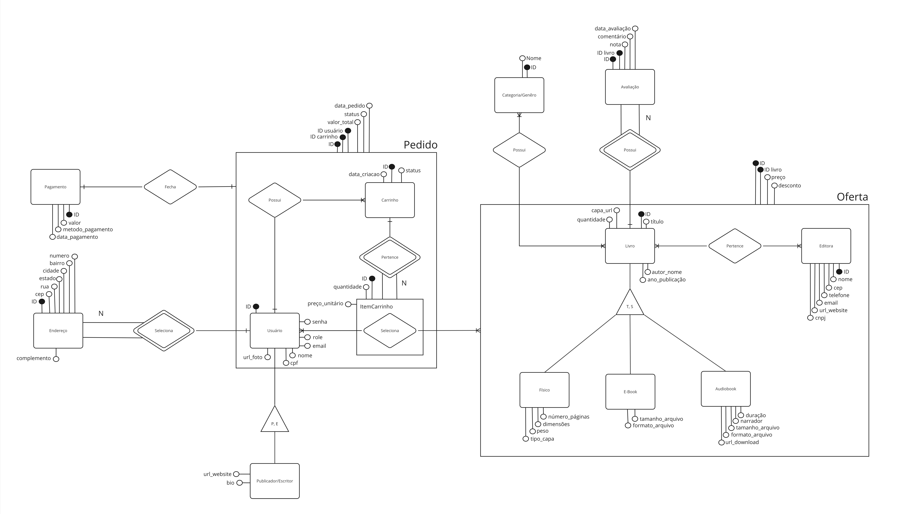

# Modelagem de Banco de Dados

## Modelagem Conceitual

### DER (Diagrama Entidade-Relacionamento)


### Dicionário de Dados

#### Dicionário Entidade & Relacionamento

- **Users**: Representa os usuários do sistema. Cada usuário possui um CPF, nome, senha, e-mail, foto, site, biografia e um papel (role).
- **Endereço**: Contém informações de endereço dos usuários, incluindo CEP, rua, número, bairro, estado e cidade.
- **Livro**: Detalha informações dos livros, como título, quantidade, nome do autor, ano de publicação e URL da capa.
- **Livro Físico**: Especifica características físicas dos livros, como número de páginas, peso, tipo de capa e dimensões.
- **Livro Ebook**: Armazena informações sobre os e-books, incluindo tamanho do arquivo e formato.
- **Livro Audiobook**: Contém detalhes sobre os audiobooks, como tamanho do arquivo, formato, narrador e URL para download.
- **Avaliação**: Armazena avaliações dos livros feitas pelos usuários, incluindo nota, comentário e data da avaliação.
- **Categoria**: Descreve as diferentes categorias dos livros.
- **Editora**: Contém informações sobre as editoras dos livros, incluindo nome, CNPJ, CEP, telefone, e-mail e site.
- **Oferta**: Detalha as ofertas de livros, incluindo preço e desconto.
- **Carrinho**: Representa o carrinho de compras dos usuários, incluindo status do carrinho.
- **Item Carrinho**: Detalha os itens contidos no carrinho de compras.
- **Pedido**: Contém informações sobre os pedidos feitos pelos usuários, incluindo valor total e status.
- **Pagamento**: Registra os pagamentos feitos, incluindo valor, método de pagamento e data do pagamento.

#### Dicionário Tabela & Atributo

- **Users**
  - `id` (BIGSERIAL, PRIMARY KEY): Identificador único do usuário.
  - `cpf` (BIGINT, UNIQUE, NOT NULL): CPF do usuário.
  - `nome` (VARCHAR(60), NOT NULL): Nome do usuário.
  - `senha` (TEXT, NOT NULL): Senha do usuário.
  - `email` (VARCHAR(120), UNIQUE, NOT NULL): E-mail do usuário.
  - `url_foto` (TEXT): URL da foto do usuário.
  - `url_website` (TEXT): URL do site do usuário.
  - `bio` (VARCHAR(2000), NOT NULL): Biografia do usuário.
  - `role` (VARCHAR(20), NOT NULL): Papel do usuário no sistema.

- **Endereço**
  - `id` (BIGSERIAL, PRIMARY KEY): Identificador único do endereço.
  - `id_user` (BIGINT, NOT NULL, FOREIGN KEY): Identificador do usuário relacionado.
  - `cep` (BIGINT, NOT NULL): CEP do endereço.
  - `rua` (VARCHAR(120), NOT NULL): Nome da rua.
  - `numero` (SMALLINT, NOT NULL): Número do endereço.
  - `bairro` (VARCHAR(100), NOT NULL): Nome do bairro.
  - `estado` (VARCHAR(60), NOT NULL): Nome do estado.
  - `cidade` (VARCHAR(60), NOT NULL): Nome da cidade.

- **Livro**
  - `id` (BIGSERIAL, PRIMARY KEY): Identificador único do livro.
  - `titulo` (VARCHAR(120), NOT NULL): Título do livro.
  - `quantidade` (SMALLINT, NOT NULL): Quantidade disponível.
  - `autor_nome` (VARCHAR(160), NOT NULL): Nome do autor.
  - `ano_publicacao` (DATE, NOT NULL): Ano de publicação.
  - `capa_url` (TEXT, NOT NULL): URL da capa do livro.

- **Livro Físico**
  - `id` (BIGSERIAL, PRIMARY KEY): Identificador único do livro físico.
  - `id_user` (BIGINT, NOT NULL, FOREIGN KEY): Identificador do usuário relacionado.
  - `numero_de_paginas` (SMALLINT, NOT NULL): Número de páginas.
  - `peso` (SMALLINT, NOT NULL): Peso do livro.
  - `tipo_capa` (VARCHAR(60), NOT NULL): Tipo de capa.
  - `dimensao_altura` (SMALLINT, NOT NULL): Altura do livro.
  - `dimensao_largura` (SMALLINT, NOT NULL): Largura do livro.
  - `dimensao_profundidade` (SMALLINT, NOT NULL): Profundidade do livro.

- **Livro Ebook**
  - `id` (BIGSERIAL, PRIMARY KEY): Identificador único do e-book.
  - `id_user` (BIGINT, NOT NULL, FOREIGN KEY): Identificador do usuário relacionado.
  - `tamanho_arquivo` (SMALLINT, NOT NULL): Tamanho do arquivo.
  - `formato_arquivo` (VARCHAR(40), NOT NULL): Formato do arquivo.

- **Livro Audiobook**
  - `id` (BIGSERIAL, PRIMARY KEY): Identificador único do audiobook.
  - `id_user` (BIGINT, NOT NULL, FOREIGN KEY): Identificador do usuário relacionado.
  - `tamanho_arquivo` (SMALLINT, NOT NULL): Tamanho do arquivo.
  - `formato_arquivo` (VARCHAR(40), NOT NULL): Formato do arquivo.
  - `narrador` (VARCHAR(120), NOT NULL): Nome do narrador.
  - `url_download` (TEXT, NOT NULL): URL para download.

- **Avaliação**
  - `id` (BIGSERIAL, PRIMARY KEY): Identificador único da avaliação.
  - `id_user` (BIGINT, NOT NULL, FOREIGN KEY): Identificador do usuário relacionado.
  - `id_livro` (BIGINT, NOT NULL, FOREIGN KEY): Identificador do livro relacionado.
  - `nota` (SMALLINT, NOT NULL, CHECK(nota IN (0, 1, 2, 3, 4, 5))): Nota da avaliação.
  - `comentario` (VARCHAR(1000), NOT NULL): Comentário da avaliação.
  - `data_avaliacao` (DATE, DEFAULT CURRENT_DATE): Data da avaliação.

- **Categoria**
  - `id` (BIGSERIAL, PRIMARY KEY): Identificador único da categoria.
  - `nome` (VARCHAR(60), NOT NULL): Nome da categoria.

- **Livro Possui Categoria**
  - `id_livro` (BIGINT, NOT NULL, FOREIGN KEY): Identificador do livro.
  - `id_categoria` (BIGINT, NOT NULL, FOREIGN KEY): Identificador da categoria.
  - `UNIQUE (id_livro, id_categoria)`: Constrição de unicidade para garantir que a combinação livro-categoria seja única.

- **Editora**
  - `id` (BIGSERIAL, PRIMARY KEY): Identificador único da editora.
  - `nome` (VARCHAR(120), NOT NULL): Nome da editora.
  - `cnpj` (BIGINT, UNIQUE, NOT NULL): CNPJ da editora.
  - `cep` (BIGINT, NOT NULL): CEP da editora.
  - `telefone` (BIGINT, NOT NULL): Telefone da editora.
  - `email` (VARCHAR(120), UNIQUE, NOT NULL): E-mail da editora.
  - `url_website` (TEXT): URL do site da editora.

- **Livro Pertence a Editora**
  - `id_livro` (BIGINT, NOT NULL, FOREIGN KEY): Identificador do livro.
  - `id_editora` (BIGINT, NOT NULL, FOREIGN KEY): Identificador da editora.
  - `UNIQUE (id_livro, id_editora)`: Constrição de unicidade para garantir que a combinação livro-editora seja única.

- **Oferta**
  - `id` (BIGSERIAL, PRIMARY KEY): Identificador único da oferta.
  - `id_livro` (BIGINT, NOT NULL, FOREIGN KEY): Identificador do livro.
  - `id_editora` (BIGINT, FOREIGN KEY): Identificador da editora.
  - `preco` (MONEY, NOT NULL): Preço da oferta.
  - `desconto` (DECIMAL(5, 2)): Desconto aplicado à oferta.

- **Carrinho**
  - `id` (BIGSERIAL, PRIMARY KEY): Identificador único do carrinho.
  - `id_user` (BIGINT, NOT NULL, FOREIGN KEY): Identificador do usuário.
  - `data_criacao` (DATE, DEFAULT CURRENT_DATE): Data de criação do carrinho.
  - `status` (BOOLEAN, DEFAULT FALSE): Status do carrinho.

- **Item Carrinho**
  - `id` (BIGSERIAL, PRIMARY KEY): Identificador único do item no carrinho.
  - `id_user` (BIGINT, NOT NULL, FOREIGN KEY): Identificador do usuário.
  - `id_oferta` (BIGINT, NOT NULL, FOREIGN KEY): Identificador da oferta.
  - `id_carrinho` (BIGINT, NOT NULL, FOREIGN KEY): Identificador do carrinho.
  - `quantidade` (SMALLINT, NOT NULL): Quantidade do item.
  - `preco_unitario` (MONEY, NOT NULL): Preço unitário do item.
  - `UNIQUE (id_user, id_oferta, id_carrinho)`: Constrição de unicidade para garantir que a combinação usuário-oferta-carrinho seja única.

- **Pedido**
  - `id` (BIGSERIAL, PRIMARY KEY): Identificador único do pedido.
  - `id_user` (BIGINT, NOT NULL, FOREIGN KEY): Identificador do usuário.
  - `id_carrinho` (BIGINT, NOT NULL, FOREIGN KEY): Identificador do carrinho.
  - `valor_total` (MONEY, NOT NULL): Valor total do pedido.
  - `status` (BOOLEAN, DEFAULT FALSE): Status do pedido.
  - `data_pedido` (DATE, DEFAULT CURRENT_DATE): Data do pedido.

- **Pagamento**
  - `id` (BIGSERIAL, PRIMARY KEY): Identificador único do pagamento.
  - `id_pedido` (BIGINT, NOT NULL, FOREIGN KEY): Identificador do pedido.
  - `valor` (MONEY, NOT NULL): Valor do pagamento.
  - `metodo_pagamento` (VARCHAR(100), NOT NULL): Método de pagamento.
  - `data_pagamento` (DATE, DEFAULT CURRENT_DATE): Data do pagamento.

## Modelagem Lógica

<!-- Descrição da modelagem lógica -->

## Modelagem Física 

### SQL

```sql
CREATE TABLE users (
    id BIGSERIAL PRIMARY KEY,
    cpf BIGINT UNIQUE NOT NULL,
    nome VARCHAR(60) NOT NULL, 
    senha TEXT NOT NULL, 
    email VARCHAR(120) UNIQUE NOT NULL,
    url_foto TEXT,
    url_website TEXT, 
    bio VARCHAR(2000) NOT NULL,
    role VARCHAR(20) NOT NULL
);

CREATE TABLE endereco (
    id BIGSERIAL PRIMARY KEY, 
    id_user BIGINT NOT NULL,
    cep BIGINT NOT NULL,
    rua VARCHAR(120) NOT NULL,
    numero SMALLINT NOT NULL,
    bairro VARCHAR(100) NOT NULL,
    estado VARCHAR(60) NOT NULL,
    cidade VARCHAR(60) NOT NULL,
    CONSTRAINT fk_user_in_endereco FOREIGN KEY (id_user) REFERENCES users (id)
);

CREATE TABLE livro (
    id BIGSERIAL PRIMARY KEY, 
    titulo VARCHAR(120) NOT NULL, 
    quantidade SMALLINT NOT NULL,
    autor_nome VARCHAR(160) NOT NULL,
    ano_publicacao DATE NOT NULL,
    capa_url TEXT NOT NULL
);

CREATE TABLE livro_fisico (
    id BIGSERIAL PRIMARY KEY, 
    id_user BIGINT NOT NULL,
    numero_de_paginas SMALLINT NOT NULL,
    peso SMALLINT NOT NULL,
    tipo_capa VARCHAR(60) NOT NULL,
    dimensao_altura SMALLINT NOT NULL,
    dimensao_largura SMALLINT NOT NULL,
    dimensao_profundidade SMALLINT NOT NULL,
    CONSTRAINT fk_user_in_livrofisico FOREIGN KEY (id_user) REFERENCES users (id)
);

CREATE TABLE livro_ebook (
    id BIGSERIAL PRIMARY KEY, 
    id_user BIGINT NOT NULL,
    tamanho_arquivo SMALLINT NOT NULL,
    formato_arquivo VARCHAR(40) NOT NULL,
    CONSTRAINT fk_user_in_livroebook FOREIGN KEY (id_user) REFERENCES users (id)
);

CREATE TABLE livro_audiobook (
    id BIGSERIAL PRIMARY KEY, 
    id_user BIGINT NOT NULL,
    tamanho_arquivo SMALLINT NOT NULL,
    formato_arquivo VARCHAR(40) NOT NULL,
    narrador VARCHAR(120) NOT NULL, 
    url_download TEXT NOT NULL,
    CONSTRAINT fk_user_in_livroaudiobook FOREIGN KEY (id_user) REFERENCES users (id)
);

CREATE TABLE avaliacao (
    id BIGSERIAL PRIMARY KEY, 
    id_user BIGINT NOT NULL,
    id_livro BIGINT NOT NULL, 
    nota SMALLINT CHECK(nota IN (0, 1, 2, 3, 4, 5)) NOT NULL,
    comentario VARCHAR(1000) NOT NULL,
    data_avaliacao DATE DEFAULT CURRENT_DATE, 
    CONSTRAINT fk_user_in_avaliacao FOREIGN KEY (id_user) REFERENCES users (id),
    CONSTRAINT fk_livro_in_avaliacao FOREIGN KEY (id_livro) REFERENCES livro (id)
);

CREATE TABLE categoria (
    id BIGSERIAL PRIMARY KEY, 
    nome VARCHAR(60) NOT NULL
);

CREATE TABLE livro_possui_categoria (
    id_livro BIGINT NOT NULL,
    id_categoria BIGINT NOT NULL,
    CONSTRAINT uq_idlivro_e_idcategoria UNIQUE (id_livro, id_categoria), 
    CONSTRAINT fk_livro_in_livro_possui_categoria FOREIGN KEY (id_livro) REFERENCES livro (id),
    CONSTRAINT fk_categoria_in_livro_possui_categoria FOREIGN KEY (id_categoria) REFERENCES categoria (id)
);

CREATE TABLE editora (
    id BIGSERIAL PRIMARY KEY, 
    nome VARCHAR(120) NOT NULL,
    cnpj BIGINT UNIQUE NOT NULL,
    cep BIGINT NOT NULL, 
    telefone BIGINT NOT NULL, 
    email VARCHAR(120) UNIQUE NOT NULL,
    url_website TEXT
);

CREATE TABLE livro_pertence_a_editora (
    id_livro BIGINT NOT NULL,
    id_editora BIGINT NOT NULL,
    CONSTRAINT uq_idlivro_e_ideditora UNIQUE (id_livro, id_editora),
    CONSTRAINT fk_livro_in_livro_pertence_a_editora FOREIGN KEY (id_livro) REFERENCES livro (id), 
    CONSTRAINT fk_editora_in_livro_pertence_a_editora FOREIGN KEY (id_editora) REFERENCES editora (id)
);

CREATE TABLE oferta (
    id BIGSERIAL PRIMARY KEY, 
    id_livro BIGINT NOT NULL,
    id_editora BIGINT,
    preco MONEY NOT NULL,
    desconto DECIMAL(5, 2),
    CONSTRAINT fk_livro_in_oferta FOREIGN KEY (id_livro) REFERENCES livro (id),
    CONSTRAINT fk_editora_in_oferta FOREIGN KEY (id_editora) REFERENCES editora (id)
);

CREATE TABLE carrinho (
    id BIGSERIAL PRIMARY KEY, 
    id_user BIGINT NOT NULL,
    data_criacao DATE DEFAULT CURRENT_DATE,
    status BOOLEAN DEFAULT FALSE,
    CONSTRAINT fk_user_in_carrinho FOREIGN KEY (id_user) REFERENCES users (id)
);

CREATE TABLE item_carrinho (
    id BIGSERIAL PRIMARY KEY, 
    id_user BIGINT NOT NULL,
    id_oferta BIGINT NOT NULL,
    id_carrinho BIGINT NOT NULL,
    quantidade SMALLINT NOT NULL,
    preco_unitario MONEY NOT NULL,
    CONSTRAINT uq_user_oferta_carrinho UNIQUE (id_user, id_oferta, id_carrinho),
    CONSTRAINT fk_user_in_item_carrinho FOREIGN KEY (id_user) REFERENCES users (id), 
    CONSTRAINT fk_oferta_in_item_carrinho FOREIGN KEY (id_oferta) REFERENCES oferta (id),
    CONSTRAINT fk_carrinho_in_item_carrinho FOREIGN KEY (id_carrinho) REFERENCES carrinho (id)
);

CREATE TABLE pedido (
    id BIGSERIAL PRIMARY KEY, 
    id_user BIGINT NOT NULL,
    id_carrinho BIGINT NOT NULL,
    valor_total MONEY NOT NULL,
    status BOOLEAN DEFAULT FALSE, 
    data_pedido DATE DEFAULT CURRENT_DATE, 
    CONSTRAINT fk_user_in_pedido FOREIGN KEY (id_user) REFERENCES users (id),
    CONSTRAINT fk_carrinho_in_pedido FOREIGN KEY (id_carrinho) REFERENCES carrinho (id)
);

CREATE TABLE pagamento (
    id BIGSERIAL PRIMARY KEY, 
    id_pedido BIGINT NOT NULL,
    valor MONEY NOT NULL,
    metodo_pagamento VARCHAR(100) NOT NULL,
    data_pagamento DATE DEFAULT CURRENT_DATE, 
    CONSTRAINT fk_pedido_in_pagamento FOREIGN KEY (id_pedido) REFERENCES pedido (id)
);
````
#

### SQL + COMMENT ON

<!-- Comentários em SQL -->

### Ocupação de Database (Peso)

#### Tabelas

<!-- Informações sobre a ocupação das tabelas -->

#### Índices

<!-- Informações sobre a ocupação dos índices -->

### Triggers

#### Trigger01

<!-- Descrição da Trigger01 -->

#### Trigger02

<!-- Descrição da Trigger02 -->